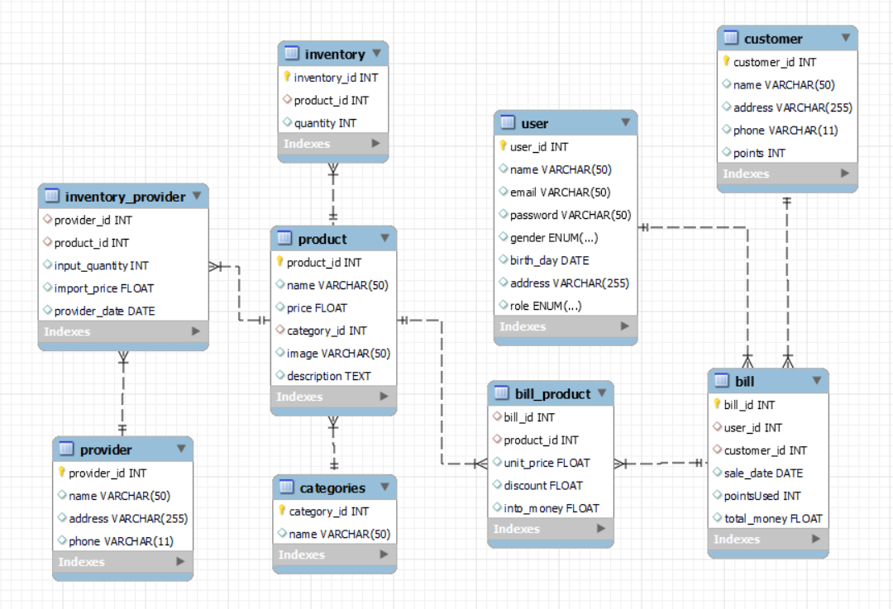

# THIẾT KẾ VÀ QUẢN TRỊ CƠ SỞ DỮ LIỆU CHO CỬA HÀNG TẠP HÓA

## I. GIỚI THIỆU
  Trong bối cảnh kinh doanh hiện đại, việc quản lý hiệu quả thông tin là yếu tố then chốt giúp cửa hàng tạp hóa tối ưu hóa hoạt động và nâng cao trải nghiệm khách hàng. Thiết kế và quản trị cơ sở dữ liệu đóng vai trò quan trọng trong việc lưu trữ, xử lý và truy xuất thông tin một cách nhanh chóng và chính xác.
  Cơ sở dữ liệu cho cửa hàng tạp hóa sẽ bao gồm các bảng chính như sản phẩm, khách hàng, nhà cung cấp, và hóa đơn..v.v. Mỗi bảng được thiết kế với các thuộc tính cụ thể và được liên kết với nhau thông qua các khóa chính và khóa ngoại, đảm bảo tính nhất quán và toàn vẹn dữ liệu.
  
  [Chi tiết các bảng](https://docs.google.com/document/d/1bOKUUjul4Mwm5oMOFJdI_gzApttZw0TeSaZ1M99D3Iw/edit)
## II. Mô hình thực thể liên kết:

